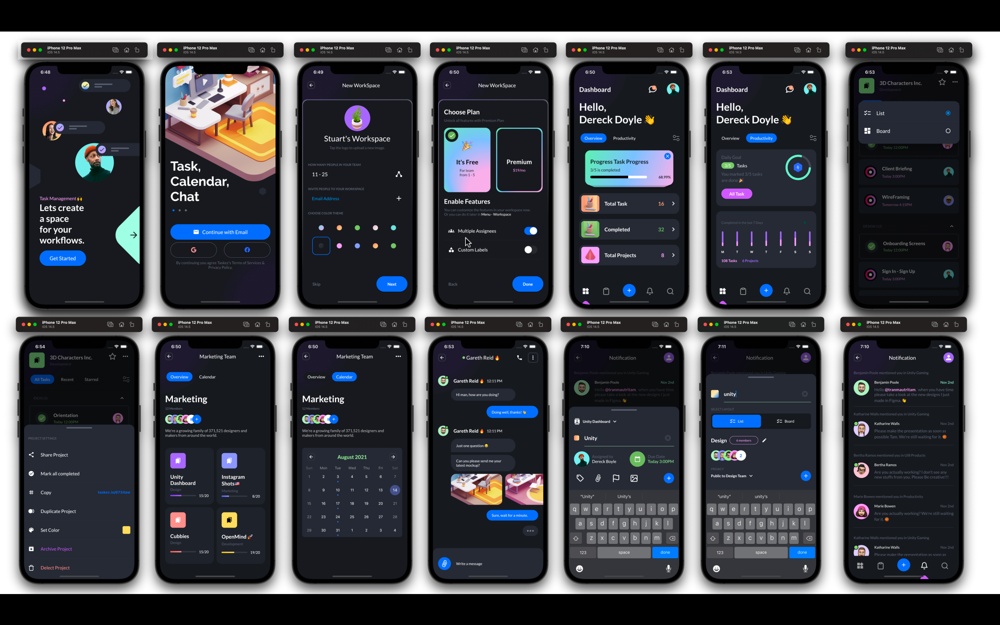
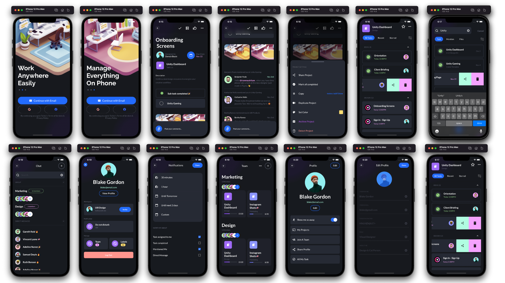
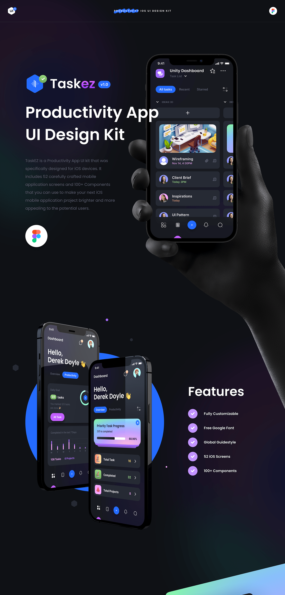
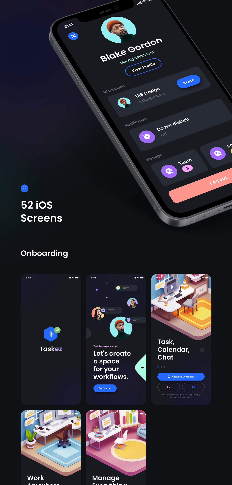
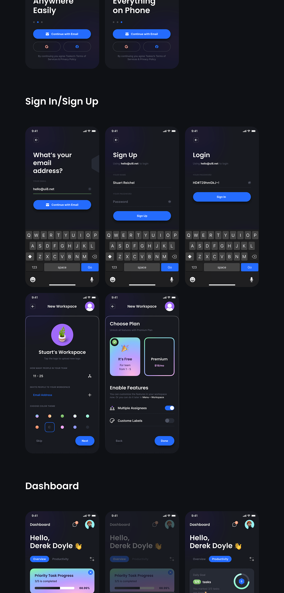
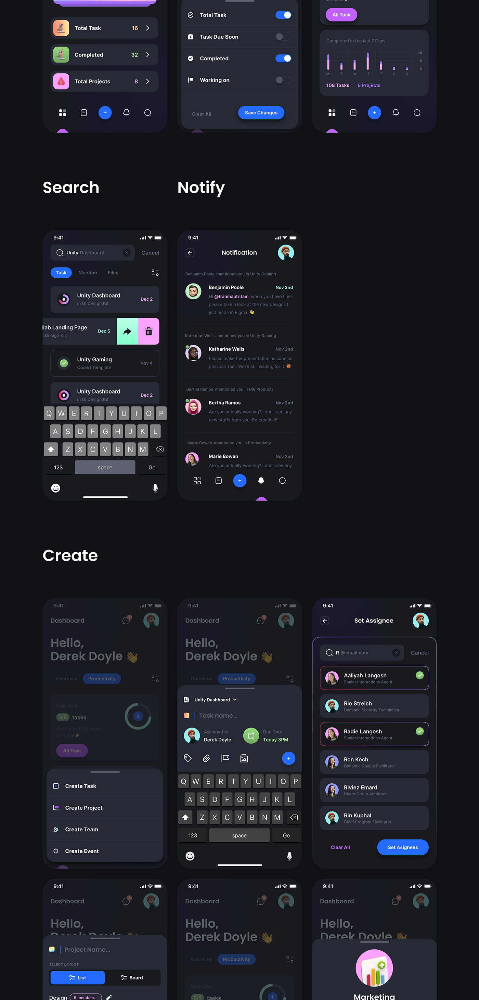
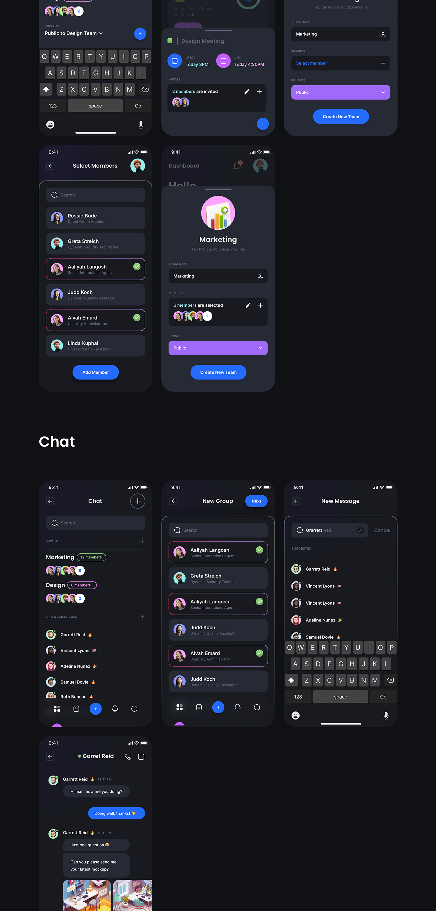
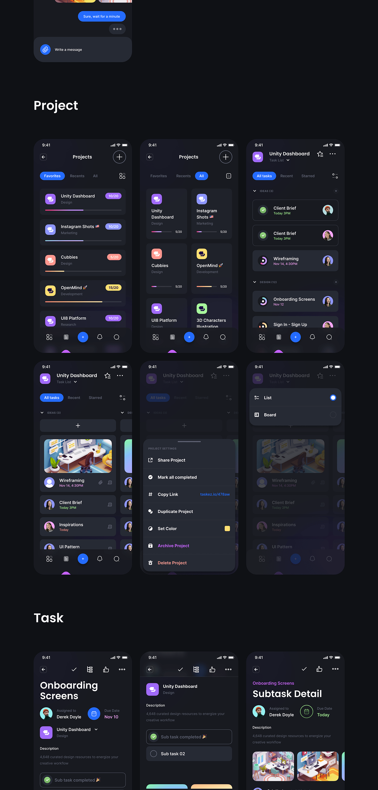
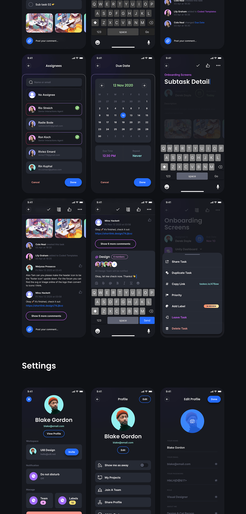
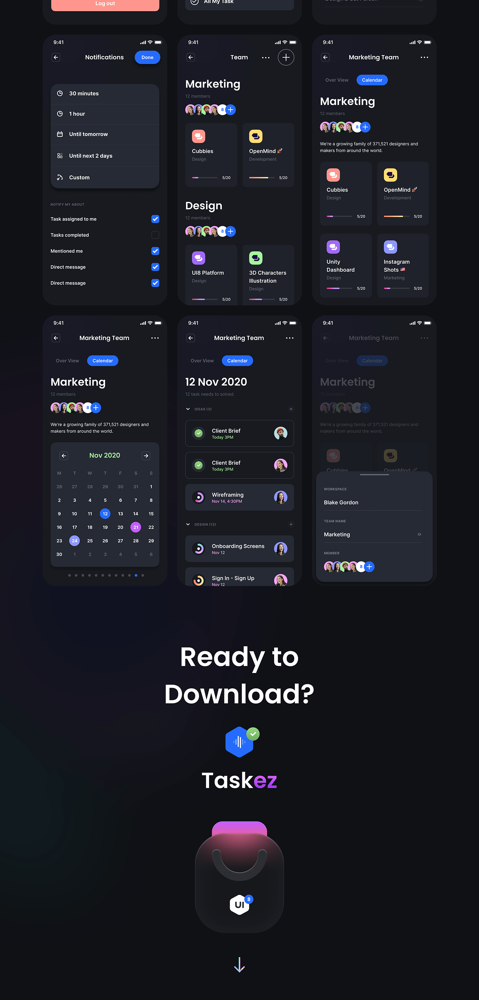

# Taskez

A productivity mobile application UI kit built with Flutter

<h3 align="center">Designs and inspiration by <a href="https://www.behance.net/gallery/108149857/TaskEz-Productivity-App-iOS-UI-Kit"> Taskez IOS UI kit.</a></h3>

 
 
<h3 align="center"> Application Flow - <a href="https://youtu.be/VpYzfUInOYE">Youtube</a></h3>

### Show some :heart: and star the repo to support the project

   

 

  
Screenshots

  

  
  
  

<a href="https://www.behance.net/gallery/108149857/TaskEz-Productivity-App-iOS-UI-Kit"> Taskez UI Designs.</a>

  <!--  -->
  
  
  
  
  
  
  

